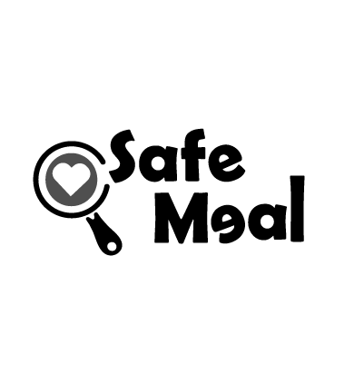

  

# 🌐 SMAS - SafeMeal Frontend

**SafeMeal Frontend** es la interfaz web del sistema **SafeMeal (SMAS)**, desarrollada con HTML, CSS y JavaScript. Su objetivo es ofrecer una experiencia intuitiva para que los usuarios puedan registrarse, iniciar sesión y consultar recomendaciones alimentarias personalizadas de acuerdo con sus padecimientos.

---

## 🛠️ Tecnologías utilizadas

- HTML5
- CSS3
- JavaScript
- Fetch API
- Visual Studio Code

---

## 📁 Estructura del proyecto

- `css/`: hojas de estilo.
- `js/`: lógica del sistema.
- `images/`: imágenes e íconos.
- `pages/`: páginas del sistema.

---

## 👥 Integrantes

- Gabriela Calderón Benavides
- Kendall Pérez Cruz
- Denisse Ramírez Villarreal

---

## 🚀 Funcionalidades

- Registro de usuarios.
- Inicio de sesión.
- Selección de padecimientos.
- Consulta de recomendaciones alimentarias.
- Consumo de la API REST desarrollada en Spring Boot.
- Diseño responsivo e interfaz amigable.

---

## 📌 Estado del proyecto

Proyecto finalizado con el frontend completamente funcional e integrado con el backend.

---

## 📜 Historial de commits

| Fecha | Hash | Mensaje de commit | Autor |
|-------|------|-------------------|-------|
| 1/07/2026 | b21cc19 | first commit | N1sse |

---

## 📝 Notas

Este README fue actualizado manualmente.